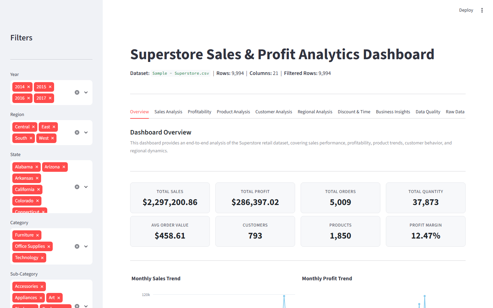
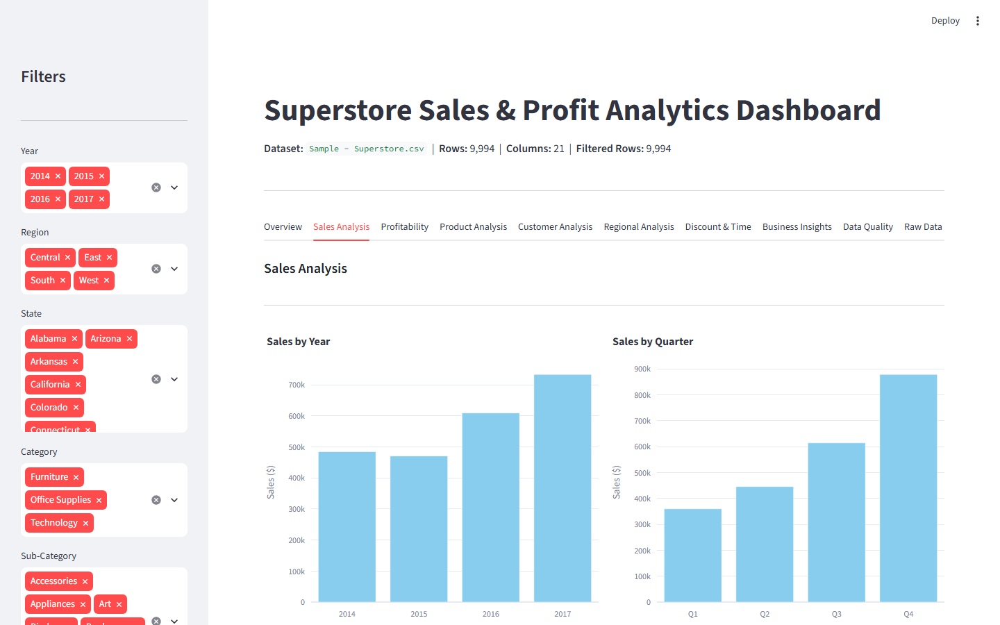
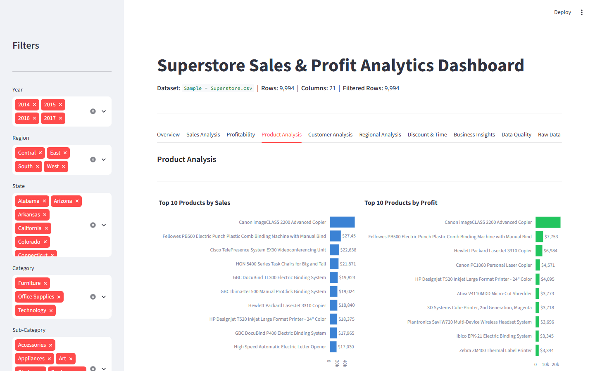
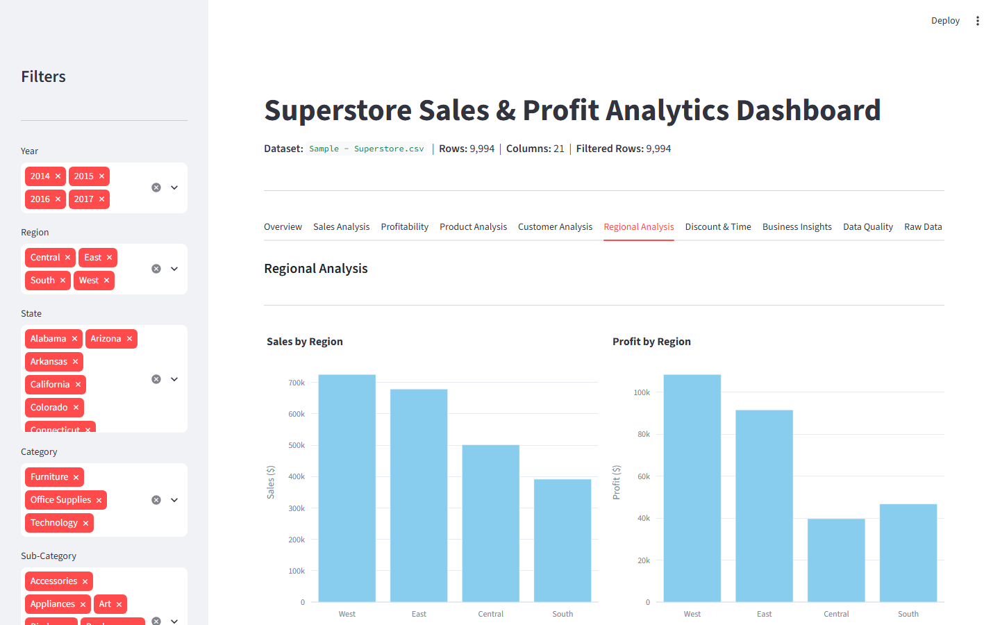
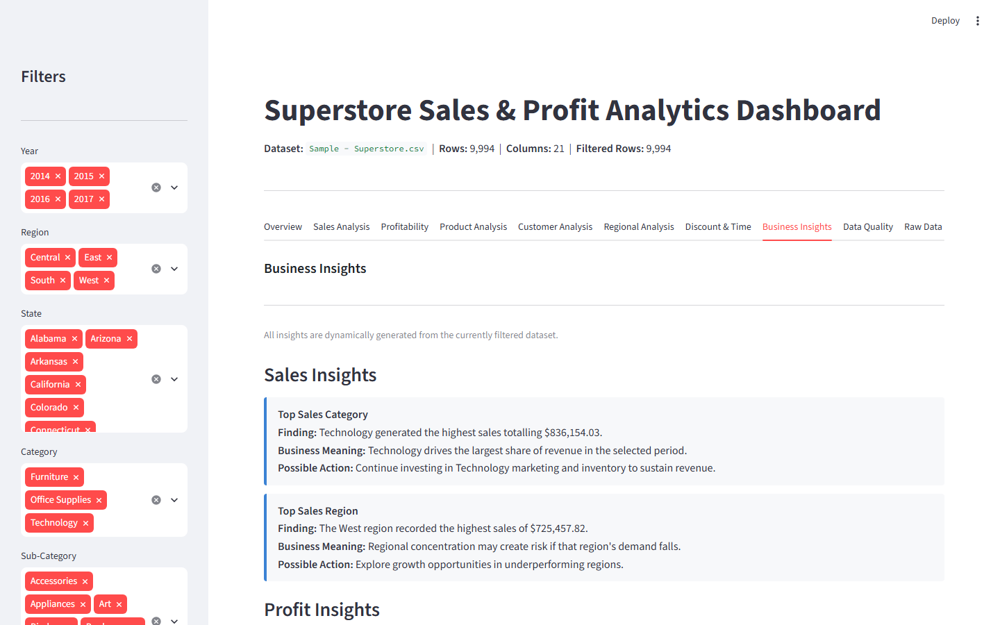

# Superstore Sales & Profit Analytics Dashboard

> **Interactive data analytics dashboard built with Python, Pandas, Plotly and Streamlit**

---

## Student Information

| Field | Details |
|---|---|
| **Name** | Shreya Jha |
| **College** | Indian Institute of Technology Patna |
| **Program** | AICTE–BharatCares–IBM SkillsBuild Internship Program |

> I, Shreya Jha, from Indian Institute of Technology Patna, participating in the AICTE–BharatCares–IBM SkillsBuild Internship Program, do hereby undertake this project as part of my internship learning and project work.

---

## GitHub Repository

**https://github.com/codedby-shreya/superstore-sales-profit-analytics**

## Live Streamlit Dashboard

Streamlit App:
https://superstore-sales-profit-analytics-kz47lffxbtudfyffzbsbdt.streamlit.app/

The project is deployed using Streamlit Community Cloud and can be accessed directly through the link above.

---

## Project Overview

This project is a comprehensive, interactive data analytics dashboard built with **Python** and **Streamlit**. It analyzes the popular **Superstore retail dataset** from Kaggle to uncover meaningful business insights about sales performance, profitability, product trends, customer behavior, and regional dynamics — all through a clean, browser-based interface.

The dashboard automatically detects the CSV file, cleans the data, engineers features, and renders 20+ interactive Plotly charts across 10 navigation tabs.

---

## Problem Statement

Large retail businesses process thousands of transactions every month. Without structured analysis, it is very difficult to identify:
- Which products are generating profit and which are creating losses
- Which regions or states are underperforming
- Which customer segments drive the most revenue
- How discounts affect overall profitability
- What seasonal patterns exist in sales and profit trends

This project addresses that challenge by providing an interactive analytics dashboard that transforms raw transaction data into actionable business insights using only Python-based tools.

---

## Objectives

1. Automatically load and validate the Superstore CSV dataset
2. Perform complete Exploratory Data Analysis (EDA)
3. Build an interactive Streamlit dashboard with sidebar filters
4. Display real-time KPI cards (Sales, Profit, Orders, Customers, Margin)
5. Analyze sales trends across time, categories, regions, and segments
6. Identify top-performing and loss-making products and sub-categories
7. Analyze customer segments and identify top customers by revenue and profit
8. Compare regional and state-level sales and profitability
9. Examine the relationship between discounts and profit
10. Generate dynamic business insights directly from the data
11. Provide a downloadable CSV export of the filtered dataset

---

## Dataset

| Field | Details |
|---|---|
| **Source** | Kaggle — Sample Superstore Sales Dataset |
| **File** | `Sample - Superstore.csv` |
| **Rows** | 9,994 |
| **Columns** | 21 |
| **Date Range** | January 3, 2014 – December 30, 2017 |
| **Regions** | East, West, Central, South |
| **Categories** | Furniture, Office Supplies, Technology |
| **Sub-Categories** | 17 (Phones, Chairs, Bookcases, Tables, Copiers, etc.) |
| **Unique Customers** | 793 |
| **Unique Products** | 1,850 |
| **Total Sales** | $2,297,200.86 |
| **Total Profit** | $286,397.02 |
| **Profit Margin** | 12.47% |

### Key Columns

| Column | Description |
|---|---|
| Order ID | Unique order identifier |
| Order Date | Date the order was placed |
| Ship Date | Date the order was shipped |
| Ship Mode | Shipping method |
| Customer ID / Name | Customer identifiers |
| Segment | Consumer / Corporate / Home Office |
| Region / State / City | Geographic fields |
| Category / Sub-Category | Product hierarchy |
| Product Name | Full product name |
| Sales | Revenue in USD |
| Quantity | Units ordered |
| Discount | Discount fraction (0–1) |
| Profit | Net profit in USD |

---

## Technologies Used

| Library | Version | Purpose |
|---|---|---|
| Python | 3.x | Core language |
| Pandas | latest | Data loading, cleaning, analysis |
| NumPy | latest | Numerical operations |
| Plotly | latest | Interactive charts and visualizations |
| Streamlit | latest | Web-based interactive dashboard |

---

## Dashboard Features

### Sidebar Filters
- Year, Region, State, Category, Sub-Category, Segment, Ship Mode
- All KPIs, tables, and charts update live when filters change

### KPI Cards (Top Row)
- Total Sales, Total Profit, Total Orders, Total Quantity
- Average Order Value, Customers, Products, Profit Margin

### 10 Navigation Tabs

| Tab | Contents |
|---|---|
| **Overview** | KPI cards, monthly trends, category/region/segment breakdown |
| **Sales Analysis** | Yearly, monthly, quarterly, category, sub-category, regional breakdowns |
| **Profitability** | Profit trends, profit by category/region/sub-category, Sales vs Profit scatter |
| **Product Analysis** | Top/Bottom 10 products, loss-making products, product summary table |
| **Customer Analysis** | Segment performance, top 10 customers, customer summary table |
| **Regional Analysis** | Region and state-level comparisons (top 15 states) |
| **Discount & Time** | Discount range analysis, scatter plots, time trends by day/month/year |
| **Business Insights** | Dynamic findings: Finding → Business Meaning → Possible Action |
| **Data Quality** | Missing values, duplicates, data types, describe() statistics |
| **Raw Data** | View and download filtered dataset as CSV |

---

## Data Processing Pipeline

1. **Data Loading** — Auto-detects and loads `.csv` file using Pandas with `@st.cache_data`
2. **Data Validation** — Checks for missing values, duplicate rows, and incorrect data types
3. **Data Cleaning** — Removes duplicate rows; coerces invalid numerics to NaN
4. **Date Conversion** — Converts `Order Date` and `Ship Date` to Pandas datetime
5. **Feature Engineering** — Extracts Year, Month, Month Name, Quarter, Day of Week; calculates Profit Margin
6. **Aggregation** — Groups by Category, Region, Segment, Sub-Category, and time periods
7. **Visualization** — Renders interactive Plotly charts within Streamlit tabs
8. **Insight Generation** — Dynamically computes business findings from the filtered dataset

---

## Key Business Insights (Actual Data)

| Insight | Finding |
|---|---|
| **Top Sales Category** | Technology: $836,154.03 (36.4% of sales) |
| **Top Profit Category** | Technology: $145,454.95 (50.8% of profit) |
| **Most Profitable Sub-Category** | Copiers: $55,617.82 |
| **Highest Loss Sub-Category** | Tables: -$17,725.48 |
| **Top Sales Region** | West: $725,457.82 |
| **Top Sales Segment** | Consumer: $1,161,401.34 (50.6%) |
| **Sales Growth (2014–2017)** | $484K → $733K (+51.4%) |
| **Loss-Making Products** | 301 out of 1,850 products |
| **Discount-Profit Correlation** | -0.22 (negative association) |

---

## Installation

```bash
pip install -r requirements.txt
```

---

## Running the Project

```bash
streamlit run app.py
```

Open the URL shown in the terminal (default: `http://localhost:8501`) in your browser.

---

## Project Structure

```text
superstore-sales-profit-analytics/
│
├── app.py                                         ← Main Streamlit application
├── requirements.txt                               ← Python dependencies
├── README.md                                      ← Project documentation
├── Sample - Superstore.csv                        ← Kaggle dataset (input)
├── Superstore_Sales_Analytics_Presentation.pptx  ← Project presentation (16 slides)
└── screenshots/
    ├── dashboard_overview.png
    ├── sales_analysis.png
    ├── product_analysis.png
    ├── regional_profitability.png
    └── business_insights.png
```

---

## Dashboard Screenshots

### Dashboard Overview — KPI Cards, Sidebar Filters & Navigation Tabs


### Sales Analysis — Sales by Year, Quarter, Category & Region


### Product Analysis — Top 10 Products by Sales & Profit


### Regional & Profitability Analysis — Sales & Profit by Region


### Business Insights — Dynamic Findings with Actions


---

## Exploratory Data Analysis Summary

### Sales Analysis
- Total sales across 4 years: **$2,297,200.86**
- Highest sales year: **2017** ($733,215.26)
- Technology leads with 36.4% of total sales
- West region is the highest performing region

### Profitability Analysis
- Total profit: **$286,397.02** | Overall margin: **12.47%**
- Technology: highest profit ($145,454.95)
- Furniture: lowest profit ($18,451.27) despite high sales
- Tables sub-category: loss of -$17,725.48

### Product Analysis
- Top product by sales and profit: **Canon imageCLASS 2200 Advanced Copier**
- 301 products have negative total profit
- Copiers sub-category is the most profitable ($55,617.82)

### Customer Analysis
- 793 unique customers across 5,009 orders
- Consumer segment: 50.6% of all sales
- Average order value: $458.61

### Discount Analysis
- Discount-Profit correlation: **-0.22**
- Higher discounts are associated with lower profit
- Tables sub-category receives highest average discounts

---

## Limitations

- Dataset covers US transactions only (2014–2017)
- No shipping cost, return, or overhead data available
- Correlation ≠ causation (discount analysis is descriptive only)
- Dashboard is descriptive/exploratory, not predictive

---

## Future Scope

- **Sales Forecasting** — Use Prophet/ARIMA for time-series predictions
- **Customer Segmentation** — Apply K-Means clustering
- **Predictive Analytics** — Model order profitability
- **Automated Reporting** — Scheduled PDF/Excel reports
- **Cloud Deployment** — Streamlit Cloud, AWS, or GCP
- **Real-time Data** — Connect to live sales databases

---

## Acknowledgements

- Dataset: [Kaggle Sample Superstore](https://www.kaggle.com/datasets/vivek468/superstore-dataset-final)
- Program: AICTE–BharatCares–IBM SkillsBuild Internship
- Tools: Python, Pandas, NumPy, Plotly, Streamlit
